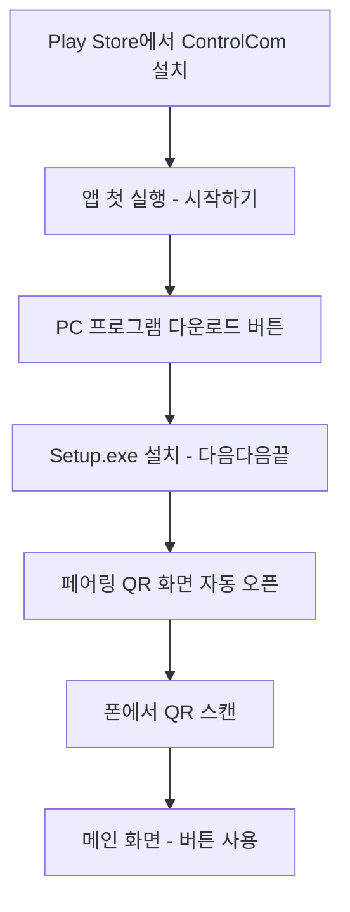

# ControlCom Play Store 출시·접근성 가이드

일반 사용자가 **쉽게 찾고 설치하고 쓰게** 만드는 방법입니다.

---

## 1. 사용자가 겪는 허들

```
Play Store에서 앱 설치  ← 쉬움
        ↓
PC 프로그램도 설치해야 함  ← 가장 큰 허들
        ↓
같은 Wi-Fi + 페어링  ← 두 번째 허들
```

**목표:** 3단계를 각각 **한 번의 탭**으로 줄이기.

---

## 2. 권장 사용자 여정 (출시 후)



| 단계 | 사용자 행동 | 우리가 제공할 것 |
|------|-------------|------------------|
| 1 | Play Store 검색·설치 | AAB 제출, 스토어 설명 |
| 2 | 앱 열기 | 온보딩 화면 (구현됨) |
| 3 | PC 프로그램 설치 | **Setup.exe** 고정 URL |
| 4 | 페어링 | QR (구현됨) |
| 5 | 사용 | 큰 버튼 4개 |

---

## 3. 배포 채널 정리

### Android — Google Play Store

| 항목 | 내용 |
|------|------|
| 제출 파일 | `dist/ControlCom-1.0.0.aab` |
| 비용 | 개발자 계정 $25 (1회) |
| 심사 | 1~7일 |
| 사용자 접근 | Play Store 검색 "ControlCom" |

### Windows — Play Store **불가**

PC 프로그램은 **별도 채널** 필수:

| 채널 | 우선순위 | 사용자 접근성 |
|------|----------|---------------|
| **앱 내 다운로드 버튼** → GitHub Releases | 1 | ⭐⭐⭐ (온보딩에서 바로) |
| 간단한 **랜딩 페이지** (controlcom.app) | 1 | ⭐⭐⭐ |
| Microsoft Store | 2 | ⭐⭐⭐ (신뢰도 높음) |
| winget | 3 | ⭐ (고급 사용자) |

---

## 4. 접근성 좋게 만드는 체크리스트

### 앱 (Android) — 대부분 구현됨

- [x] 첫 실행 온보딩
- [x] "PC 프로그램 필요" 설명
- [x] PC 다운로드 버튼 (`AppConfig.PC_DOWNLOAD_URL`)
- [x] QR 페어링
- [ ] **다운로드 URL을 실제 Releases 주소로 변경** (출시 전 필수)
- [ ] 스토어 스크린샷에 온보딩·메인 화면 포함

### PC (Windows)

- [x] Setup.exe 스크립트 (`build-installer.ps1`)
- [x] 설치 시 자동 실행 + 방화벽 옵션
- [x] 설치 후 페어링 QR 페이지
- [ ] **GitHub Releases에 Setup.exe 업로드**
- [ ] (선택) 코드 서명 — SmartScreen 경고 제거

### 웹 (권장, 아직 없음)

간단한 1페이지 사이트:

```
controlcom.app (또는 GitHub Pages)
├── 앱 소개 (3줄)
├── Play Store 링크
├── PC 다운로드 (Setup.exe)
└── 개인정보 처리방침
```

> Play Console **개인정보 처리방침 URL** 필수 → `docs/privacy-policy.html` 호스팅

---

## 5. Play Console 등록 절차

### 사전 준비

1. [Google Play Console](https://play.google.com/console) 개발자 등록 ($25)
2. `scripts/build-android-release.ps1` → AAB 생성
3. `docs/privacy-policy.html` 웹 호스팅
4. GitHub Releases에 `ControlComAgent-Setup.exe` 업로드
5. `AppConfig.kt` URL 업데이트:
   - `PC_DOWNLOAD_URL` → 실제 Releases URL
   - `PRIVACY_POLICY_URL` → 호스팅된 정책 URL

### 스토어 등록 정보 (예시)

**짧은 설명:**
> 침대에서 Wi-Fi로 내 PC를 조종하세요. 절전, 음소거, 모니터 전환.

**긴 설명:**
> ControlCom은 같은 Wi-Fi에 연결된 Windows PC를 스마트폰으로 간편하게 제어하는 앱입니다.
>
> PC에 ControlCom Agent를 설치한 후 QR 코드로 연결하세요.
>
> 기능: 절전 모드, 음소거, 주 모니터만 사용, 저장 후 종료
>
> ※ PC 프로그램 설치가 필요합니다.

**데이터 안전성:** 데이터 수집 없음

**권한 설명:**
- 인터넷: PC와 LAN 통신
- 카메라: QR 페어링 (선택)

### 심사 시 주의

- "원격 제어" 성격 → **같은 Wi-Fi만**, 외부 서버 없음 명시
- 개인정보 처리방침 URL 필수
- 스크린샷에 PC 프로그램 필요하다고 명시

---

## 6. 출시 순서 (권장)

```
1. GitHub Releases: PC Setup.exe v1.0
2. privacy-policy.html 호스팅
3. AppConfig URL 업데이트 → AAB 재빌드
4. Play Console 내부 테스트 (본인·지인)
5. 공개 출시
6. (이후) Microsoft Store, winget
```

---

## 7. 사용자에게 보여줄 한 줄 안내

> **Play Store에서 앱 설치 → 앱 안내에 따라 PC 프로그램 설치 → QR 스캔 → 끝**

---

## 8. 관련 문서

- [상시 실행 가이드](GUIDE_ALWAYS_ON.md)
- [보안 가이드](SECURITY.md)
- [배포 기획](PRODUCT_DISTRIBUTION_PLAN.md)
- [개발자 가이드](DEVELOPER_GUIDE.md)
