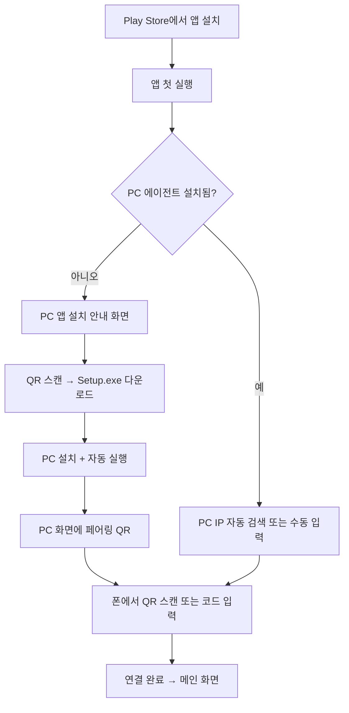

# ControlCom 배포·스토어 출시 기획

Play Store(Android) + PC 에이전트(Windows) 양쪽 배포를 전제로 한 제품·기술·운영 계획.

---

## 1. 제품 포지션

### 한 줄 정의

> **침대·소파에서 Wi-Fi로 내 PC를 조종하는 리모컨 앱**

### 핵심 가치

| 사용자 상황 | 제공 가치 |
|-------------|-----------|
| 누워 있을 때 | 절전, 음소거, 모니터 전환, 저장 후 종료 |
| PC 앞에 가기 귀찮을 때 | LAN 버튼 몇 번으로 끝 |
| 듀얼 모니터 사용 시 | 주 모니터만 켜기 / 복구 |

### 경쟁·대안

| 대안 | 한계 |
|------|------|
| KDE Connect | 기능 많지만 설정 복잡, 목적이 다름 |
| Unified Remote | 유료·범용 리모컨, PC 프로그램 필요 |
| Microsoft Phone Link | 통화·알림 중심, 절전·모니터 제어 약함 |
| 원격 데스크톱 (Parsec 등) | 화면 미러링, “버튼 한 번” UX 아님 |

**차별점:** 기능을 **4개에만 집중**, 버튼 크고 단순, **누운 자세 UX** 최적화.

### 타겟

| 단계 | 타겟 | 규모 |
|------|------|------|
| 1차 (현재) | 본인 + 지인 | 개인·소규모 |
| 2차 (스토어) | PC+안드로이드 쓰는 집에서 “멀리서 PC 끄기” 니즈 있는 사람 | 니치 |
| 3차 (확장) | 같은 Wi-Fi의 “내 PC” 제어 일반화 | 중·소규모 |

**현실적 기대:** 대중 앱보다 **니치 유틸리티**. PC 프로그램 2번째 설치 허들은 있지만, 니즈가 맞으면 감수함.

---

## 2. 배포 구조 (양면 제품)

```
┌─────────────────────────────────────────────────────────┐
│                    사용자 기기                            │
├──────────────────────┬──────────────────────────────────┤
│  Android (S24+ 등)   │  Windows PC                      │
│  ControlCom 앱       │  ControlCom Agent                │
│  ─────────────       │  ─────────────────               │
│  배포: Play Store    │  배포: 설치 파일 / MS Store      │
│  형식: AAB           │  형식: Setup.exe / MSI           │
│  역할: UI·요청만     │  역할: 명령 실행 (SSOT 소유)      │
└──────────────────────┴──────────────────────────────────┘
              │ LAN HTTP (동일 Wi-Fi) │
              └───────────────────────┘
```

**원칙 (기존 SSOT 유지)**

- Android는 PC 상태를 **직접 변경하지 않음**
- API 계약: [`SSOT_API.md`](SSOT_API.md)
- PC 에이전트가 Sleep / Mute / Display / Shutdown의 **유일한 실행 주체**

---

## 3. 배포 채널 전략

### Android — Google Play Store

| 항목 | 내용 |
|------|------|
| 제출 형식 | **AAB** (Android App Bundle) |
| 빌드 | `./gradlew bundleRelease` |
| 서명 | **Release keystore** (Play App Signing 권장) |
| 업데이트 | Play Console 내부 테스트 → 공개 |

**Play에 필요한 산출물**

- AAB 파일
- 앱 아이콘 (512px), 스크린샷 (폰)
- 짧은/긴 설명 (한·영)
- **개인정보 처리방침 URL** (필수)
- 데이터 안전성 설문: “데이터 수집 없음 / LAN만 사용” 명시
- 권한 설명: `INTERNET` = PC와 통신

### Windows — PC 에이전트

Play Store에 PC 앱은 올릴 수 없음. **별도 채널** 필수.

| 채널 | 우선순위 | 용도 |
|------|----------|------|
| **공식 웹 + Setup.exe** | 1 | 일반 사용자 메인 다운로드 |
| **GitHub Releases** | 1 (병행) | 버전 관리·개발자 신뢰 |
| **Microsoft Store** | 2 | “공식 앱” 신뢰·자동 업데이트 |
| **winget** | 3 | `winget install ControlCom.Agent` |

**설치 파일 요구사항**

- 원클릭 설치 (Next → Finish)
- 설치 시 옵션:
  - [x] Windows 로그인 시 자동 실행
  - [x] 방화벽 규칙 추가 (Private 네트워크)
- 설치 완료 후 **페어링 QR / 6자리 코드** 표시
- **코드 서명** (SmartScreen “알 수 없는 게시자” 완화)

**기술 스택 후보**

- `.NET 8` publish (self-contained 단일 폴더)
- 패키징: **Inno Setup** 또는 **WiX** → `ControlComAgent-Setup.exe`

---

## 4. 사용자 온보딩 (스토어 출시용)

### 이상적인 첫 실행 흐름



### 현재(MVP) vs 스토어 목표

| 단계 | 현재 | 스토어 목표 |
|------|------|-------------|
| PC 설치 | `dotnet run` / 수동 | Setup.exe 원클릭 |
| 페어링 | 콘솔 6자리 코드 | QR + 코드 병행 |
| PC IP | 수동 입력 | mDNS/Bonjour 자동 발견 (선택) |
| 방화벽 | PowerShell 스크립트 | 설치 마법사 내 처리 |
| APK 전달 | Snapdrop 등 | Play Store |

### “PC 프로그램 또 깔아야 해?” 대응

앱 내 카피 예시:

> ControlCom은 **내 PC를 조종**하는 앱입니다.  
> PC에서 명령을 받을 **작은 프로그램**이 필요합니다. (Spotify·게임 런처와 같음)  
> Wi-Fi로만 연결되며, **외부 서버로 데이터를 보내지 않습니다.**

---

## 5. 보안·정책 (스토어 심사 대비)

### 기술

| 항목 | 방침 |
|------|------|
| 통신 | LAN only, HTTP → 추후 HTTPS(자체서명 또는 로컬) |
| 인증 | Bearer 토큰, 1회 페어링 |
| 외부 접근 | 포트포워딩 불필요, 권장하지 않음 |
| PC 방화벽 | Private 프로필만 허용 |

### Play 정책

- **원격 제어** 성격 → 악용 가능성 설명 필요
- 개인정보: **수집 안 함** → 처리방침에 “로컬 통신만” 명시
- 민감 권한 최소화 (현재 `INTERNET`만)

### PC SmartScreen

- 코드 서명 인증서 (유료, 연간) → 스토어급 출시 시 권장
- 초기: 서명 없이 배포 시 “추가 정보” 클릭 필요 → FAQ에 안내

---

## 6. 기능·제품 로드맵

### Phase A — 개인용 MVP (완료)

- [x] Sleep, 음소거, 모니터 1개, 저장 후 종료
- [x] LAN REST, Bearer 페어링
- [x] APK 빌드

### Phase B — 배포 기반 (스토어 전)

| 작업 | Android | PC |
|------|---------|-----|
| Release 서명 | keystore 생성, `bundleRelease` | 코드 서명 준비 |
| 온보딩 | “PC 앱 필요” 안내 화면 | Setup.exe + 트레이 아이콘 |
| 페어링 UX | QR 스캔 (ZXing) | QR 표시 (설치 완료 화면) |
| 다운로드 | 앱 내 링크 → 고정 URL | `controlcom.app/download` 등 |
| 문서 | 개인정보 처리방침 페이지 | 설치 가이드 |

### Phase C — Play Store 출시

- 내부 테스트 트랙 (본인·지인)
- 스토어 등록: 스크린샷, 설명, 정책 URL
- AAB 제출, 심사 대응
- PC Setup.exe v1.0 동시 공개

### Phase D — 운영·확장 (선택)

- mDNS로 PC 자동 검색 (`_controlcom._tcp`)
- Microsoft Store / winget
- 앱·에이전트 **버전 호환** 체크 (`/api/health` version)
- 원격이 아닌 **같은 계정** 페어링 (선택)
- iOS는 PC 에이전트 재사용 가능하나 별도 앱 개발 필요

---

## 7. 수익·라이선스 (참고)

| 모델 | 적합성 |
|------|--------|
| 무료 | 개인·니치에 적합, 초기 권장 |
| 일회성 유료 | PC+앱 번들 판매 가능 |
| 구독 | 기능·가치 대비 과함 (현 단계) |

**권장:** 1차 **완전 무료** → 사용자·피드백 확보 후 검토.

---

## 8. 리스크

| 리스크 | 영향 | 대응 |
|--------|------|------|
| PC 2번째 설치 허들 | 설치 이탈 | Setup 원클릭, QR 온보딩 |
| Play 심사 (원격 제어) | 출시 지연 | 정책·설명 선제 작성 |
| APK 직접 배포 차단 (카톡·드라이브) | 지인 전달 어려움 | Play Store가 정식 해결책 |
| 저장 후 종료 미보장 | 리뷰 악화 | UI에 한계 명시, Sleep 권장 |
| SmartScreen 경고 | PC 설치 이탈 | 코드 서명, MS Store 검토 |

---

## 9. 산출물 체크리스트

### Play Store 제출 시

- [ ] `app-release.aab`
- [ ] Release keystore (백업 필수)
- [ ] 512px 아이콘, 스크린샷 2장 이상
- [ ] 개인정보 처리방침 URL
- [ ] 데이터 안전성: 수집 없음
- [ ] PC 앱 다운로드 URL (스토어 설명·앱 내 링크)

### PC 에이전트 공개 시

- [ ] `ControlComAgent-Setup.exe` (서명)
- [ ] 자동 시작 + 방화벽 옵션
- [ ] 페어링 QR 화면
- [ ] GitHub Releases / 웹 다운로드 페이지
- [ ] README 설치 가이드

---

## 10. 마일스톤 요약

```
[지금]     MVP 동작 + APK 수동 설치
    ↓
[Phase B]  keystore + Setup.exe + QR 온보딩 (4~6주)
    ↓
[Phase C]  Play 내부 테스트 → 공개 출시
    ↓
[Phase D]  mDNS, MS Store, 운영 자동화
```

---

## 11. 다음 구현 우선순위 (개발 착수용)

1. **Android release keystore** + `bundleRelease` 파이프라인
2. **PC Setup.exe** (Inno Setup, self-contained publish)
3. **앱 첫 실행 온보딩** — “PC 프로그램 설치” + 다운로드 URL
4. **QR 페어링** — PC 표시 / 폰 스캔
5. **개인정보 처리방침** 웹 페이지 (GitHub Pages 가능)
6. Play Console 개발자 계정 등록 ($25 일회)

---

## 12. 한 줄 결론

- **Play Store = AAB**, **PC = Setup.exe** 가 정식 조합.
- PC 프로그램은 **없앨 수 없고**, 설치·페어링을 **QR + 원클릭**으로 줄이는 게 핵심.
- 카톡·드라이브 APK 차단은 **스토어 출시가 근본 해결**.
- 1차 타겟은 **니치 유틸**; 대중화는 온보딩 UX가 성패를 가름.
